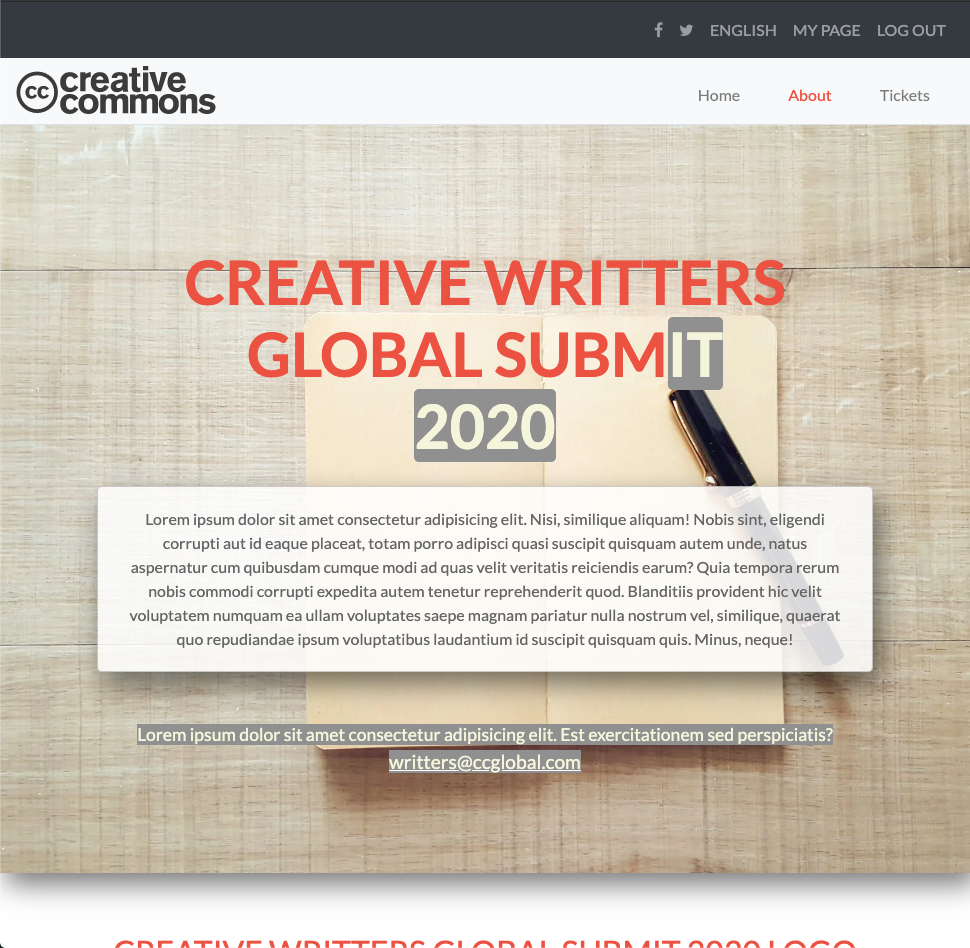

# HTML & CSS capstone project: Conference page

> HTML & CSS Capstone Project is based on an online website for a conference.

This project was made essentially using bootstrap, but there are also some parts with plain CSS to demonstrate the same behaviors as bootstrap offers but using just flex and grid.

## Built With

- HTML, CSS
- Bootstrap framework

## Live Demo

[Live Demo Link](https://rawcdn.githack.com/emasdev/html-capstone/d3d2b449484edac51178cf133c0842c504e6fbd5/index.html)

👤 **Emanuel González**

- Github: [@emasdev](https://github.com/emasdev)
- Linkedin: [@linkedin](https://linkedin.com/emasdev)

## 🤝 Contributing

Contributions, issues and feature requests are welcome!

Feel free to check the [issues page](issues/).

## Show your support

Give a ⭐️ if you like this project!

## 📝 License

This project is [MIT](lic.url) licensed.
